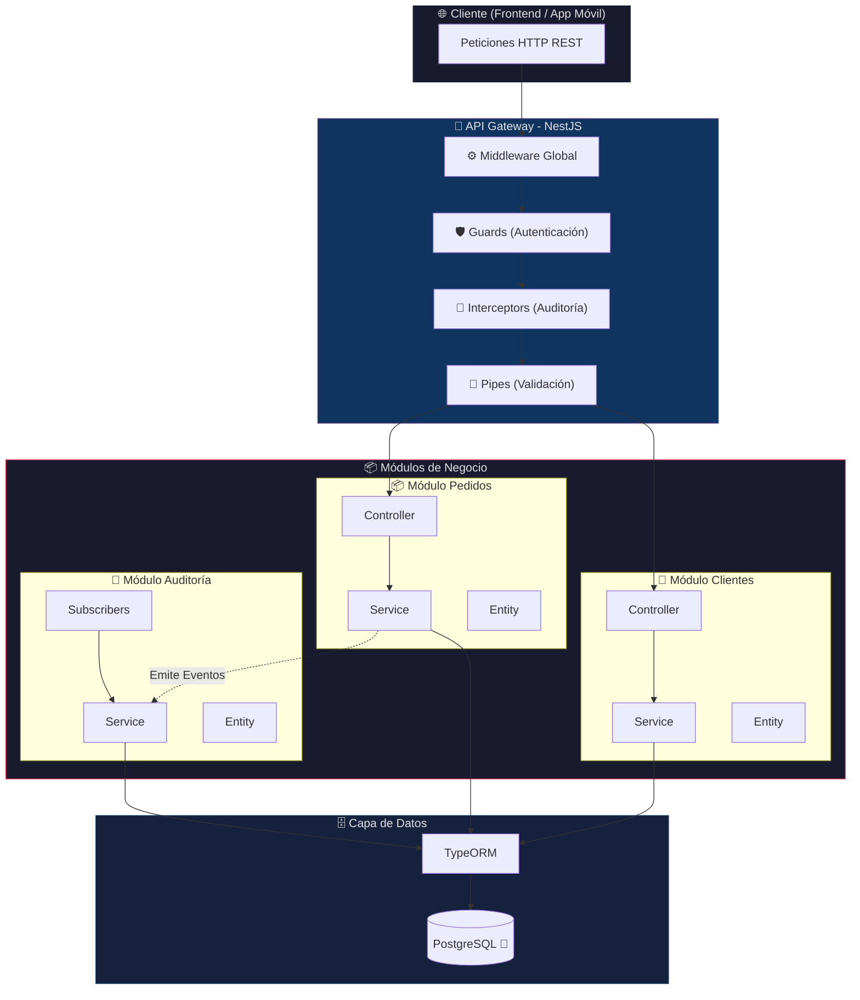
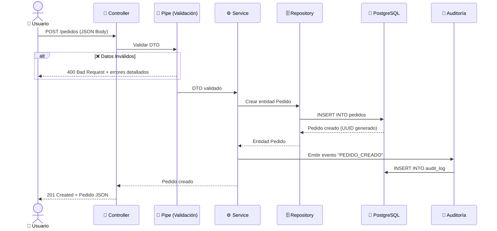
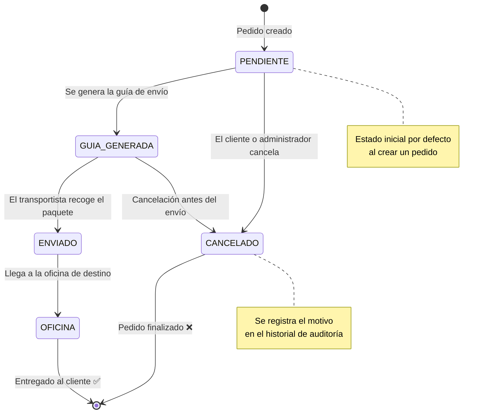
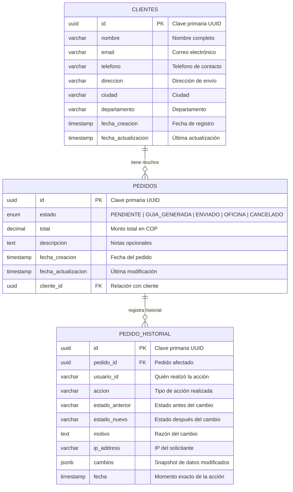
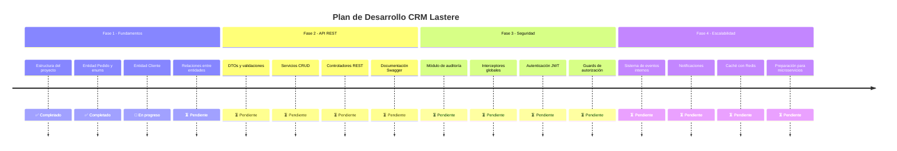

<div align="center">

# 🚀 CRM LASTERE

### Sistema de Gestión de Relaciones con Clientes y Pedidos

[](https://nestjs.com/)
[](https://www.typescriptlang.org/)
[](https://www.postgresql.org/)
[](https://typeorm.io/)
[](https://www.sena.edu.co/)
[](#)

<br/>

<p align="center">
  <strong>CRM empresarial moderno construido con arquitectura modular, diseñado para el mercado colombiano 🇨🇴</strong>
</p>

<p align="center">
  Gestión integral de clientes · Seguimiento de pedidos en tiempo real · Auditoría de seguridad · API RESTful escalable
</p>

---

**[📖 Descripción](#-descripción-del-proyecto)** · **[⚙️ Configuración](#️-requisitos-y-configuración)** · **[🏗️ Arquitectura](#️-arquitectura)** · **[📦 Módulos](#-módulos)** · **[🗄️ Base de Datos](#️-modelo-de-base-de-datos)** · **[🛣️ Roadmap](#️-roadmap)**

</div>

---

## 📋 Descripción del Proyecto

**CRM Lastere** es un sistema backend robusto de gestión de relaciones con clientes (CRM) y administración de pedidos. Este proyecto está siendo desarrollado de forma conjunta para una **empresa privada** como solución corporativa y, al mismo tiempo, como **proyecto estudiantil y formativo** para la institución **SENA (Servicio Nacional de Aprendizaje)** en el programa de formación de **Tecnología en Análisis y Desarrollo de Software**.

El sistema permite centralizar la información de los clientes, realizar un seguimiento detallado del ciclo de vida de cada pedido (desde su creación hasta la entrega final) y mantener un registro completo de auditoría que garantiza la trazabilidad y la seguridad de todas las operaciones comerciales, aplicando las mejores prácticas y estándares de la industria.

### 🎯 Problema que resuelve

| Problema | Solución CRM Lastere |
| :--- | :--- |
| Información de clientes dispersa en hojas de cálculo | Base de datos centralizada y relacional con PostgreSQL |
| Sin trazabilidad en los pedidos | Sistema de estados con historial completo de cada movimiento |
| Vulnerabilidad ante modificaciones fraudulentas | Módulo de auditoría que registra cada acción con IP, usuario y timestamp |
| Dificultad para escalar el negocio | Arquitectura modular preparada para una futura transición a microservicios |
| Manejo incorrecto de montos en pesos colombianos | Tipo `decimal` con precisión financiera (11 dígitos, 2 decimales en COP) |

---

## ✨ Características Principales

<table>
<tr>
<td width="50%">

### 👥 Gestión de Clientes
- Registro y administración completos de clientes
- Historial de pedidos por cliente
- Datos de contacto y direcciones de envío
- Segmentación y categorización de clientes

</td>
<td width="50%">

### 📦 Gestión de Pedidos
- Creación y seguimiento detallado de pedidos
- Estados configurables mediante Enums
- Cálculo de totales con precisión financiera
- Descripción y notas por pedido

</td>
</tr>
<tr>
<td width="50%">

### 🔐 Seguridad y Auditoría
- Registro automático de cada operación en base de datos
- Captura de dirección IP y User-Agent
- Historial de cambios con estado anterior y nuevo
- Detección preventiva de modificaciones sospechosas

</td>
<td width="50%">

### 🛠️ Arquitectura Profesional
- Principios SOLID aplicados rigurosamente
- TypeScript estricto (sin uso de `any`)
- Arquitectura modular y escalable
- Documentación y comentarios explicativos

</td>
</tr>
</table>

---

## 🏗️ Arquitectura

El proyecto sigue una **arquitectura modular por capas**, donde cada módulo encapsula su propia lógica de negocio, entidades, DTOs y controladores. Esta estructura permite escalar el sistema de forma independiente y facilita la transición futura a microservicios.



### Flujo de una petición HTTP



---

## 📦 Módulos

### Estructura del proyecto

```
crm-lastere/
│
├── 📄 .env.example                    # Variables de entorno de ejemplo
├── 📄 .gitignore                      # Archivos de configuración excluidos de Git
├── 🐳 docker-compose.yml             # Configuración de contenedores Docker
├── 📄 nest-cli.json                   # Configuración del CLI de NestJS
├── 📄 package.json                    # Dependencias y scripts del proyecto
├── 📄 tsconfig.json                   # Configuración de TypeScript
│
└── 📁 src/
    ├── 📄 main.ts                     # Punto de entrada de la aplicación
    ├── 📄 app.module.ts               # Módulo raíz que orquesta todo el sistema
    │
    ├── 📁 common/                     # Recursos compartidos globalmente
    │   └── 📁 auditoria/             # 🔐 Módulo de Auditoría (Fase 2)
    │
    ├── 📁 config/                     # Configuración y validación de entorno
    │   └── 📄 env.validation.ts       # Validación de variables de entorno
    │
    └── 📁 modules/                    # Módulos de negocio
        │
        ├── 📁 clientes/              # 👥 Módulo de Clientes
        │   ├── 📄 clientes.controller.ts
        │   ├── 📄 clientes.module.ts
        │   ├── 📄 clientes.service.ts
        │   └── 📁 entities/
        │       └── 📄 cliente.entity.ts
        │
        └── 📁 pedidos/               # 📦 Módulo de Pedidos
            ├── 📄 pedidos.controller.ts
            ├── 📄 pedidos.module.ts
            ├── 📄 pedidos.service.ts
            ├── 📁 entities/
            │   └── 📄 pedido.entity.ts
            └── 📁 enums/
                └── 📄 estado-pedido.enum.ts
```

---

### 📦 Módulo de Pedidos

El módulo de pedidos es el corazón del sistema. Gestiona el ciclo de vida completo de cada pedido.

#### Estados del pedido



#### Campos de la entidad Pedido

| Campo | Tipo (PostgreSQL) | Tipo (TypeScript) | Descripción |
| :--- | :---: | :---: | :--- |
| `id` | `UUID` | `string` | Identificador único generado automáticamente |
| `estado` | `ENUM` | `EstadoPedido` | Estado actual del pedido (valores predefinidos) |
| `total` | `DECIMAL(11,2)` | `number` | Monto total en COP con precisión financiera |
| `descripcion` | `TEXT` | `string \| null` | Notas u observaciones opcionales del pedido |
| `fecha_creacion` | `TIMESTAMP` | `Date` | Fecha y hora de creación (automática) |
| `fecha_actualizacion` | `TIMESTAMP` | `Date` | Fecha y hora de la última modificación (automática) |

> 💡 **Nota sobre la moneda:** Los montos se manejan en **Pesos Colombianos (COP)** con precisión `DECIMAL(11,2)`, soportando valores de hasta **$999,999,999.99 COP**.

---

## 🗄️ Modelo de base de datos



---

## ⚙️ Requisitos y Configuración

Para la ejecución y despliegue del proyecto en entornos de desarrollo, se requiere contar con las herramientas adecuadas y la respectiva configuración de variables de entorno.

### Prerrequisitos

Asegúrese de tener instaladas las siguientes tecnologías:

| Herramienta | Versión Mínima | Propósito |
| :--- | :---: | :--- |
| **Node.js** | v18+ | Entorno de ejecución para el backend |
| **npm** | v9+ | Gestor de paquetes de dependencias |
| **Docker** | v24+ | Gestión de contenedores locales |
| **Docker Compose** | v2+ | Orquestación de servicios locales |

### Configuración del Entorno

1. **Variables de Entorno**: Configure el archivo local `.env` a partir de la plantilla provista en `.env.example`. Asegúrese de definir las variables correspondientes a la conexión de la base de datos sin incluir credenciales expuestas en el código fuente.
2. **Servicios de Base de Datos**: Levante el contenedor de la base de datos relacional configurado en el archivo de orquestación de servicios locales.
3. **Instalación de Dependencias**: Instale los paquetes requeridos especificados en la configuración del proyecto utilizando el gestor de paquetes de Node.js.
4. **Ejecución del Servidor**: Inicie el servidor de desarrollo utilizando el script de inicio correspondiente definido en el proyecto.

---

## 🛠️ Stack tecnológico

<div align="center">

| Capa | Tecnología | Propósito |
| :---: | :---: | :--- |
| 🔷 **Runtime** | Node.js v18+ | Entorno de ejecución de JavaScript del lado del servidor |
| 🏗️ **Framework** | NestJS v10 | Framework empresarial para aplicaciones escalables |
| 📝 **Lenguaje** | TypeScript v5 | Tipado estricto para un código seguro y mantenible |
| 🗄️ **Base de Datos** | PostgreSQL v16 | Motor relacional robusto con soporte para tipos ENUM y JSONB |
| 🔗 **ORM** | TypeORM v0.3 | Mapeo objeto-relacional con decoradores y migraciones |
| 🐳 **Contenedores** | Docker Compose | Infraestructura reproducible y portable |
| ✅ **Validación** | class-validator | Validación de datos de entrada con decoradores |
| 🔄 **Transformación** | class-transformer | Transformación y serialización de objetos |

</div>

---

## 🛣️ Roadmap

El desarrollo del proyecto está organizado en fases incrementales:



---

## 📐 Lineamientos de Desarrollo

El desarrollo del proyecto se rige bajo los siguientes estándares de calidad de software y buenas prácticas de ingeniería:

| Estándar | Descripción |
| :--- | :--- |
| **TypeScript Estricto** | Todo el código debe implementar tipado estricto para garantizar la robustez y prevenir errores en tiempo de ejecución. |
| **Prohibición de `any`** | Cada variable, parámetro y tipo de retorno debe estar explícitamente tipado. |
| **Principios SOLID** | Adherencia a los cinco principios de diseño orientado a objetos para obtener un sistema altamente mantenible y escalable. |
| **TypeORM** | Todas las interacciones con la base de datos relacional deben realizarse a través del ORM, garantizando abstracción y seguridad. |
| **Arquitectura Modular** | Organización del código en módulos autónomos y cohesivos dentro de NestJS para facilitar el desarrollo en paralelo. |
| **Contexto Colombia** | Lógica adaptada al mercado colombiano, utilizando tipos de datos precisos para el manejo de importes en Pesos Colombianos (COP). |

---

## 🤝 Sugerencias y Retroalimentación

Este es un proyecto cerrado y de propiedad privada, diseñado con fines corporativos y como proyecto de aprendizaje académico. Por este motivo, **no se aceptan contribuciones directas de código externas ni solicitudes de extracción (Pull Requests)**.

Si desea realizar comentarios, sugerir mejoras, reportar problemas o realizar consultas sobre el diseño del sistema, puede hacerlo exclusivamente a través de la sección de **comentarios, discusiones o incidencias (Issues)** habilitada en el repositorio oficial.

### Convención de commits

Para el desarrollo interno del equipo de trabajo, se sigue estrictamente la convención de [Conventional Commits](https://www.conventionalcommits.org/):

| Prefijo | Uso |
| :--- | :--- |
| `feat:` | Nueva funcionalidad |
| `fix:` | Corrección de errores |
| `chore:` | Tareas de mantenimiento (configuración, dependencias) |
| `docs:` | Cambios en documentación |
| `refactor:` | Refactorización sin cambio de funcionalidad |
| `test:` | Adición o modificación de pruebas |

---

<div align="center">

### Desarrollado con ❤️ para el mercado colombiano 🇨🇴

**CRM Lastere** © 2026 · Todos los derechos reservados

[](https://github.com/sernapereira/crm-lastere)

</div>
