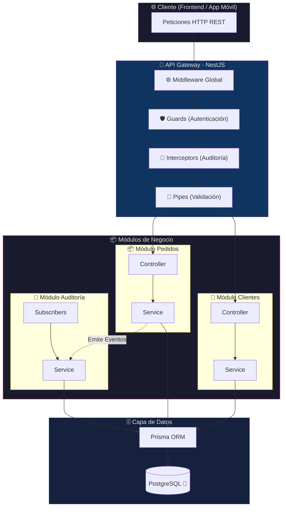
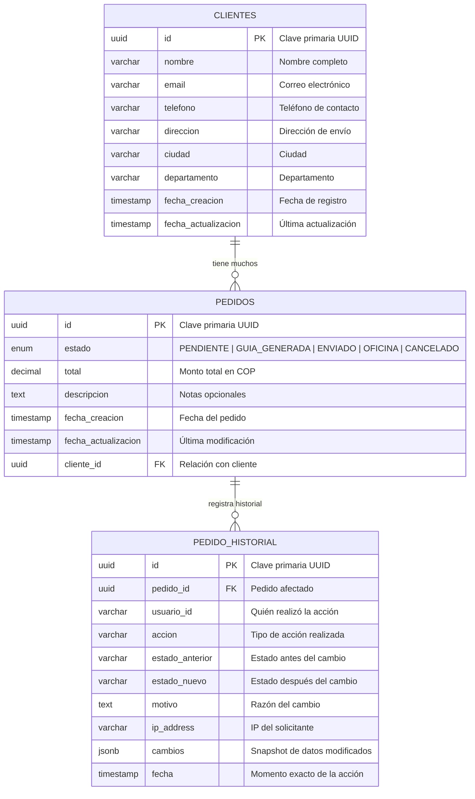

<div align="center">

# 🚀 CRM LASTERE

### Sistema de Gestión de Relaciones con Clientes y Pedidos

[](#-estado-actual-del-proyecto)
[](https://nestjs.com/)
[](https://www.typescriptlang.org/)
[](https://www.postgresql.org/)
[](https://www.prisma.io/)
[](https://www.sena.edu.co/)
[](#)

<br/>

<p align="center">
  <strong>CRM empresarial moderno construido con arquitectura modular, diseñado para el mercado colombiano 🇨🇴</strong>
</p>

<p align="center">
  Gestión integral de clientes · Seguimiento de pedidos en tiempo real · Auditoría de seguridad · API RESTful escalable
</p>

---

**[📋 Descripción](#-descripción-del-proyecto)** · **[📊 Estado](#-estado-actual-del-proyecto)** · **[✅ Avances](#-avances-recientes)** · **[🔮 Futuro](#-futuras-actualizaciones)** · **[🏗️ Arquitectura](#️-arquitectura)** · **[⚙️ Quick Start](#️-quick-start)** · **[🗄️ Base de Datos](#️-modelo-de-base-de-datos)**

</div>

---

## 📋 Descripción del Proyecto

**CRM Lastere** es un sistema backend robusto de gestión de relaciones con clientes (CRM) y administración de pedidos. Este proyecto está siendo desarrollado de forma conjunta para una **empresa privada** como solución corporativa y, al mismo tiempo, como **proyecto estudiantil y formativo** para la institución **SENA (Servicio Nacional de Aprendizaje)** en el programa de formación de **Tecnología en Análisis y Desarrollo de Software**.

El sistema permite centralizar la información de los clientes, realizar un seguimiento detallado del ciclo de vida de cada pedido (desde su creación hasta la entrega final) y mantener un registro completo de auditoría que garantiza la trazabilidad y la seguridad de todas las operaciones comerciales.

### 🎯 Problema que resuelve

| Problema | Solución CRM Lastere |
| :--- | :--- |
| Información de clientes dispersa en hojas de cálculo | Base de datos centralizada y relacional con PostgreSQL |
| Sin trazabilidad en los pedidos | Sistema de estados con historial completo de cada movimiento |
| Vulnerabilidad ante modificaciones fraudulentas | Módulo de auditoría que registra cada acción con IP, usuario y timestamp |
| Dificultad para escalar el negocio | Arquitectura modular preparada para una futura transición a microservicios |
| Manejo incorrecto de montos en pesos colombianos | Tipo `decimal` con precisión financiera (11 dígitos, 2 decimales en COP) |

---

## 📊 Estado Actual del Proyecto

<table>
<tr>
<td width="60%">

> **Fase actual:** 🔶 Diseño y Documentación
>
> El proyecto se encuentra en su **etapa de ideación y diseño arquitectónico**. La estructura base del proyecto ha sido inicializada y se está documentando de forma detallada la arquitectura, los modelos de datos y el roadmap antes de comenzar la implementación del código funcional.

</td>
<td width="40%" align="center">

```
Progreso General
██░░░░░░░░░░░░░░░░░░  10%

Fase 1 — Fundamentos
████░░░░░░░░░░░░░░░░  20%

Fase 2 — API REST
░░░░░░░░░░░░░░░░░░░░   0%

Fase 3 — Seguridad
░░░░░░░░░░░░░░░░░░░░   0%
```

</td>
</tr>
</table>

---

## ✅ Avances Recientes

Logros completados hasta la fecha:

- [x] **Inicialización del proyecto** — Proyecto NestJS creado con TypeScript estricto
- [x] **Infraestructura Docker** — `docker-compose.yml` configurado con PostgreSQL 15 y pgAdmin
- [x] **Estructura modular de carpetas** — Módulos `clientes`, `pedidos` y `common/auditoria` definidos
- [x] **Configuración de entorno** — Archivo `.env.example` con plantilla de variables
- [x] **Documentación arquitectónica** — Diagramas de arquitectura, ER y flujos documentados
- [x] **Estándares de desarrollo** — Convención de commits, ESLint y Prettier configurados

---

## 🔄 En Curso

Lo que está activamente en desarrollo:

- [ ] 🔧 **Configuración de Prisma ORM** — Instalación, inicialización y conexión a PostgreSQL
- [ ] 📐 **Schema Prisma: Modelo Pedido** — Definición de la entidad con enums de estado
- [ ] 📐 **Schema Prisma: Modelo Cliente** — Definición de campos y validaciones
- [ ] 🔗 **Relaciones entre modelos** — Configuración de relaciones y primera migración

---

## 🔮 Futuras Actualizaciones

Roadmap organizado por fases de desarrollo:

### Fase 2 — API REST `Próximamente`

| Feature | Descripción | Prioridad |
| :--- | :--- | :---: |
| DTOs y Validaciones | Objetos de transferencia con `class-validator` | 🔴 Alta |
| Servicios CRUD | Lógica de negocio para clientes y pedidos | 🔴 Alta |
| Controladores REST | Endpoints HTTP para todas las operaciones | 🔴 Alta |
| Documentación Swagger | API autodocumentada con OpenAPI | 🟡 Media |

### Fase 3 — Seguridad `Planificada`

| Feature | Descripción | Prioridad |
| :--- | :--- | :---: |
| Módulo de Auditoría | Registro automático de cada operación | 🔴 Alta |
| Interceptores Globales | Captura de IP y User-Agent | 🟡 Media |
| Autenticación JWT | Login seguro con tokens | 🔴 Alta |
| Guards de Autorización | Control de acceso basado en roles | 🟡 Media |

### Fase 4 — Escalabilidad `Futuro`

| Feature | Descripción | Prioridad |
| :--- | :--- | :---: |
| Sistema de Eventos | Comunicación interna entre módulos | 🟡 Media |
| Notificaciones | Alertas por cambios de estado | 🟢 Baja |
| Caché con Redis | Optimización de consultas frecuentes | 🟢 Baja |
| Microservicios | Separación de módulos independientes | 🟢 Baja |

---

## ✨ Características Principales

<table>
<tr>
<td width="50%">

### 👥 Gestión de Clientes
- Registro y administración completos de clientes
- Historial de pedidos por cliente
- Datos de contacto y direcciones de envío
- Segmentación y categorización de clientes

</td>
<td width="50%">

### 📦 Gestión de Pedidos
- Creación y seguimiento detallado de pedidos
- Estados configurables mediante Enums
- Cálculo de totales con precisión financiera
- Descripción y notas por pedido

</td>
</tr>
<tr>
<td width="50%">

### 🔐 Seguridad y Auditoría
- Registro automático de cada operación en base de datos
- Captura de dirección IP y User-Agent
- Historial de cambios con estado anterior y nuevo
- Detección preventiva de modificaciones sospechosas

</td>
<td width="50%">

### 🛠️ Arquitectura Profesional
- Principios SOLID aplicados rigurosamente
- TypeScript estricto (sin uso de `any`)
- Arquitectura modular y escalable
- Documentación y comentarios explicativos

</td>
</tr>
</table>

---

## 🏗️ Arquitectura

El proyecto sigue una **arquitectura modular por capas**, donde cada módulo encapsula su propia lógica de negocio, DTOs y controladores. Esta estructura permite escalar el sistema de forma independiente y facilita la transición futura a microservicios.


```mermaid
graph TB
    subgraph Cliente["🌐 Cliente (Frontend / App Móvil)"]
        HTTP["Peticiones HTTP REST"]
    end

    subgraph API["🔷 API Gateway - NestJS"]
        direction TB
        MW["⚙️ Middleware Global"]
        GD["🛡️ Guards (Autenticación)"]
        INT["📡 Interceptors (Auditoría)"]
        PP["🔌 Pipes (Validación)"]
    end

    subgraph Modules["📦 Módulos de Negocio"]
        direction LR
        
        subgraph ModClientes["👥 Módulo Clientes"]
            CC["Controller"]
            CS["Service"]
        end
        
        subgraph ModPedidos["📦 Módulo Pedidos"]
            PC["Controller"]
            PS["Service"]
        end

        subgraph ModAuditoria["🔐 Módulo Auditoría"]
            AS["Service"]
            SUB["Subscribers"]
        end
    end

    subgraph Data["🗄️ Capa de Datos"]
        ORM["Prisma ORM"]
        DB[("PostgreSQL 🐘")]
    end

    HTTP --> MW
    MW --> GD
    GD --> INT
    INT --> PP
    PP --> CC
    PP --> PC
    CC --> CS
    PC --> PS
    CS --> ORM
    PS --> ORM
    AS --> ORM
    SUB --> AS
    ORM --> DB
    PS -.->|"Emite Eventos"| AS

    style Cliente fill:#1a1a2e,stroke:#16213e,color:#e0e0e0
    style API fill:#0f3460,stroke:#533483,color:#e0e0e0
    style Modules fill:#1a1a2e,stroke:#e94560,color:#e0e0e0
    style Data fill:#16213e,stroke:#0f3460,color:#e0e0e0
```

> 📖 **Documentación técnica ampliada:** Para diagramas detallados de flujos HTTP, máquina de estados de pedidos y especificaciones de entidades, consulte [`docs/ARCHITECTURE.md`](docs/ARCHITECTURE.md).

### Estructura del Proyecto

```
crm-lastere/
│
├── 📄 .env.example                    # Variables de entorno de ejemplo
├── 📄 .gitignore                      # Archivos excluidos de Git
├── 📄 CHANGELOG.md                    # Historial de cambios del proyecto
├── 🐳 docker-compose.yml             # PostgreSQL 15 + pgAdmin
├── 📄 nest-cli.json                   # Configuración del CLI de NestJS
├── 📄 package.json                    # Dependencias y scripts
├── 📄 tsconfig.json                   # Configuración de TypeScript
│
├── 📁 docs/
│   └── 📄 ARCHITECTURE.md            # Diagramas y documentación técnica
│
└── 📁 src/
    ├── 📄 main.ts                     # Punto de entrada de la aplicación
    ├── 📄 app.module.ts               # Módulo raíz
    │
    ├── 📁 common/                     # Recursos compartidos globalmente
    │   └── 📁 auditoria/             # 🔐 Módulo de Auditoría (Fase 3)
    │
    ├── 📁 config/                     # Configuración y validación de entorno
    │   └── 📄 env.validation.ts       # Validación de variables de entorno
    │
    └── 📁 modules/                    # Módulos de negocio
        │
        ├── 📁 clientes/              # 👥 Módulo de Clientes
        │   ├── 📄 clientes.controller.ts
        │   ├── 📄 clientes.module.ts
        │   ├── 📄 clientes.service.ts
        │   └── 📁 entities/
        │       └── 📄 cliente.entity.ts
        │
        └── 📁 pedidos/               # 📦 Módulo de Pedidos
            ├── 📄 pedidos.controller.ts
            ├── 📄 pedidos.module.ts
            ├── 📄 pedidos.service.ts
            ├── 📁 entities/
            │   └── 📄 pedido.entity.ts
            └── 📁 enums/
                └── 📄 estado-pedido.enum.ts
```

---

## 🗄️ Modelo de Base de Datos


```mermaid
erDiagram
      CLIENTES {
          uuid id PK "Clave primaria UUID"
          varchar nombre "Nombre completo"
          varchar email "Correo electrónico"
          varchar telefono "Teléfono de contacto"
          varchar direccion "Dirección de envío"
          varchar ciudad "Ciudad"
          varchar departamento "Departamento"
          timestamp fecha_creacion "Fecha de registro"
          timestamp fecha_actualizacion "Última actualización"
      }

      PEDIDOS {
          uuid id PK "Clave primaria UUID"
          enum estado "PENDIENTE | GUIA_GENERADA | ENVIADO | OFICINA | CANCELADO"
          decimal total "Monto total en COP"
          text descripcion "Notas opcionales"
          timestamp fecha_creacion "Fecha del pedido"
          timestamp fecha_actualizacion "Última modificación"
          uuid cliente_id FK "Relación con cliente"
      }

      PEDIDO_HISTORIAL {
          uuid id PK "Clave primaria UUID"
          uuid pedido_id FK "Pedido afectado"
          varchar usuario_id "Quién realizó la acción"
          varchar accion "Tipo de acción realizada"
          varchar estado_anterior "Estado antes del cambio"
          varchar estado_nuevo "Estado después del cambio"
          text motivo "Razón del cambio"
          varchar ip_address "IP del solicitante"
          jsonb cambios "Snapshot de datos modificados"
          timestamp fecha "Momento exacto de la acción"
      }

      CLIENTES ||--o{ PEDIDOS : "tiene muchos"
      PEDIDOS ||--o{ PEDIDO_HISTORIAL : "registra historial"
```

---

## ⚙️ Quick Start

### Prerrequisitos

| Herramienta | Versión Mínima | Propósito |
| :--- | :---: | :--- |
| **Node.js** | v18+ | Entorno de ejecución para el backend |
| **npm** | v9+ | Gestor de paquetes de dependencias |
| **Docker** | v24+ | Gestión de contenedores locales |
| **Docker Compose** | v2+ | Orquestación de servicios locales |

### Instalación

```bash
# 1. Clonar el repositorio
git clone https://github.com/sernapereira/crm-lastere.git
cd crm-lastere

# 2. Configurar variables de entorno
cp .env.example .env

# 3. Levantar la base de datos y pgAdmin
docker-compose up -d

# 4. Instalar dependencias
npm install

# 5. Inicializar Prisma (cuando el schema esté listo)
npx prisma generate
npx prisma migrate dev

# 6. Iniciar servidor de desarrollo
npm run start:dev
```

> 💡 **pgAdmin** estará disponible en `http://localhost:5050` con las credenciales del `.env`.

### Variables de Entorno

| Variable | Descripción | Valor por defecto |
| :--- | :--- | :---: |
| `POSTGRES_USER` | Usuario de PostgreSQL | `postgres` |
| `POSTGRES_PASSWORD` | Contraseña de PostgreSQL | `postgres` |
| `POSTGRES_DB` | Nombre de la base de datos | `crm_lastere` |
| `DB_PORT` | Puerto expuesto de PostgreSQL | `5433` |
| `PORT` | Puerto del servidor NestJS | `3000` |
| `DATABASE_URL` | URL de conexión completa | `postgresql://...` |

---

## 🛠️ Stack Tecnológico

<div align="center">

| Capa | Tecnología | Propósito |
| :---: | :---: | :--- |
| 🔷 **Runtime** | Node.js v18+ | Entorno de ejecución de JavaScript del lado del servidor |
| 🏗️ **Framework** | NestJS v10 | Framework empresarial para aplicaciones escalables |
| 📝 **Lenguaje** | TypeScript v5 | Tipado estricto para un código seguro y mantenible |
| 🗄️ **Base de Datos** | PostgreSQL v15 | Motor relacional robusto con soporte para tipos ENUM y JSONB |
| 🔗 **ORM** | Prisma | ORM moderno con schema declarativo, type-safety total y migraciones automáticas |
| 🐳 **Contenedores** | Docker Compose | Infraestructura reproducible y portable |
| ✅ **Validación** | class-validator | Validación de datos de entrada con decoradores |
| 🔄 **Transformación** | class-transformer | Transformación y serialización de objetos |

</div>

---

## 📐 Lineamientos de Desarrollo

| Estándar | Descripción |
| :--- | :--- |
| **TypeScript Estricto** | Todo el código debe implementar tipado estricto para garantizar la robustez y prevenir errores en tiempo de ejecución. |
| **Prohibición de `any`** | Cada variable, parámetro y tipo de retorno debe estar explícitamente tipado. |
| **Principios SOLID** | Adherencia a los cinco principios de diseño orientado a objetos para obtener un sistema altamente mantenible y escalable. |
| **Prisma ORM** | Todas las interacciones con la base de datos relacional deben realizarse a través de **Prisma Client**, garantizando type-safety completo y migraciones controladas mediante `prisma migrate`. |
| **Arquitectura Modular** | Organización del código en módulos autónomos y cohesivos dentro de NestJS para facilitar el desarrollo en paralelo. |
| **Contexto Colombia** | Lógica adaptada al mercado colombiano, utilizando tipos de datos precisos para el manejo de importes en Pesos Colombianos (COP). |

---

## 🤝 Sugerencias y Retroalimentación

Este es un proyecto cerrado y de propiedad privada, diseñado con fines corporativos y como proyecto de aprendizaje académico. Por este motivo, **no se aceptan contribuciones directas de código externas ni solicitudes de extracción (Pull Requests)**.

Si desea realizar comentarios, sugerir mejoras o reportar problemas, puede hacerlo a través de la sección de **Issues** del repositorio.

### Convención de Commits

Para el desarrollo interno, se sigue estrictamente la convención de [Conventional Commits](https://www.conventionalcommits.org/):

| Prefijo | Uso |
| :--- | :--- |
| `feat:` | Nueva funcionalidad |
| `fix:` | Corrección de errores |
| `chore:` | Tareas de mantenimiento |
| `docs:` | Cambios en documentación |
| `refactor:` | Refactorización sin cambio de funcionalidad |
| `test:` | Adición o modificación de pruebas |

---

<div align="center">

### Desarrollado con ❤️ para el mercado colombiano 🇨🇴

**CRM Lastere** © 2026 · Todos los derechos reservados

[](https://github.com/sernapereira/crm-lastere)
[](CHANGELOG.md)

</div>
