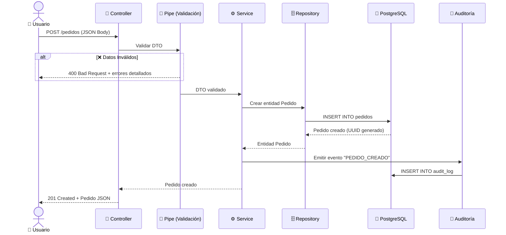
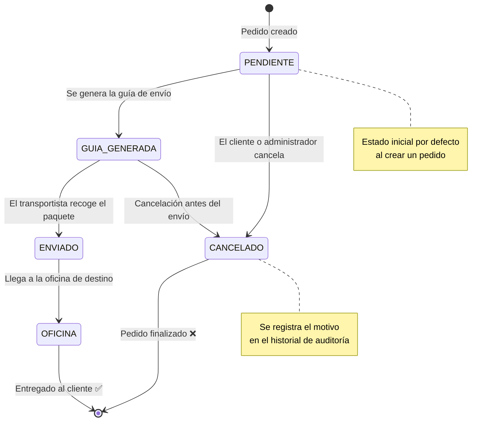

# 🏗️ Arquitectura — CRM Lastere

Documentación técnica detallada del diseño arquitectónico del sistema.

---

## 📡 Flujo de una Petición HTTP

El siguiente diagrama muestra el recorrido completo de una petición desde que llega al servidor hasta que se persiste en la base de datos y se registra en el módulo de auditoría.

---

## 📦 Estados del Pedido

El módulo de pedidos gestiona el ciclo de vida completo de cada pedido mediante una máquina de estados definida con `enum` en Prisma.

---

## 🗃️ Campos de la Entidad Pedido

| Campo | Tipo (PostgreSQL) | Tipo (TypeScript) | Descripción |
| :--- | :---: | :---: | :--- |
| `id` | `UUID` | `string` | Identificador único generado automáticamente (Prisma `@default(uuid())`) |
| `estado` | `ENUM` | `EstadoPedido` | Estado actual del pedido (Prisma `enum EstadoPedido`) |
| `total` | `DECIMAL(11,2)` | `Decimal` | Monto total en COP con precisión financiera (Prisma `@db.Decimal(11,2)`) |
| `descripcion` | `TEXT` | `string \| null` | Notas u observaciones opcionales del pedido |
| `fecha_creacion` | `TIMESTAMP` | `DateTime` | Fecha y hora de creación (Prisma `@default(now())`) |
| `fecha_actualizacion` | `TIMESTAMP` | `DateTime` | Fecha y hora de la última modificación (Prisma `@updatedAt`) |

> 💡 **Nota sobre la moneda:** Los montos se manejan en **Pesos Colombianos (COP)** con precisión `DECIMAL(11,2)`, soportando valores de hasta **$999,999,999.99 COP**.

---

## 🗃️ Campos de la Entidad Cliente

| Campo | Tipo (PostgreSQL) | Tipo (TypeScript) | Descripción |
| :--- | :---: | :---: | :--- |
| `id` | `UUID` | `string` | Clave primaria UUID |
| `nombre` | `VARCHAR` | `string` | Nombre completo del cliente |
| `email` | `VARCHAR` | `string` | Correo electrónico |
| `telefono` | `VARCHAR` | `string` | Teléfono de contacto |
| `direccion` | `VARCHAR` | `string` | Dirección de envío |
| `ciudad` | `VARCHAR` | `string` | Ciudad |
| `departamento` | `VARCHAR` | `string` | Departamento |
| `fecha_creacion` | `TIMESTAMP` | `DateTime` | Fecha de registro |
| `fecha_actualizacion` | `TIMESTAMP` | `DateTime` | Última actualización |

---

## 🔐 Campos de la Entidad Pedido Historial (Auditoría)

| Campo | Tipo (PostgreSQL) | Tipo (TypeScript) | Descripción |
| :--- | :---: | :---: | :--- |
| `id` | `UUID` | `string` | Clave primaria UUID |
| `pedido_id` | `UUID (FK)` | `string` | Pedido afectado |
| `usuario_id` | `VARCHAR` | `string` | Quién realizó la acción |
| `accion` | `VARCHAR` | `string` | Tipo de acción realizada |
| `estado_anterior` | `VARCHAR` | `string \| null` | Estado antes del cambio |
| `estado_nuevo` | `VARCHAR` | `string \| null` | Estado después del cambio |
| `motivo` | `TEXT` | `string \| null` | Razón del cambio |
| `ip_address` | `VARCHAR` | `string` | IP del solicitante |
| `cambios` | `JSONB` | `object` | Snapshot de datos modificados |
| `fecha` | `TIMESTAMP` | `DateTime` | Momento exacto de la acción |

---

📖 Volver al [README principal](../README.md)

